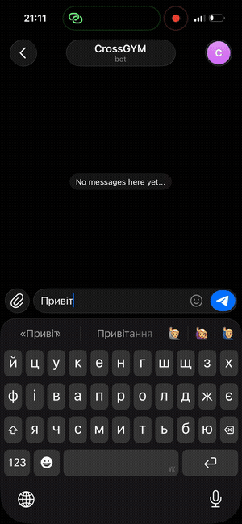

# CrossGYM RAG Assistant

[](https://github.com/radei4ko/crossgym-rag/actions/workflows/ci.yml)

A retrieval-augmented generation (RAG) system that answers questions about a gym chain
(locations, pricing, trainers, booking policy) from its real knowledge base — exposed as a
REST API and, live, as a Telegram bot. Hybrid retrieval, citation-backed answers, and an
evaluation harness that measures retrieval and generation separately — not just a prompt
wrapped in an API.

The knowledge base is real: four CrossGYM locations (Sotsmisto, Skhidnyi-2, 95 Kvartal,
Vechirniy) in Kryvyi Rih, Ukraine, with their actual pricing and trainer rosters. Content is
in Ukrainian; this README and the code are in English.

## Live demo

Talk to it on Telegram: **[@crossgym_chatbot](https://t.me/crossgym_chatbot)** — ask it about pricing,
trainers, locations, or booking policy in Ukrainian. Ask it something outside its knowledge
base and it will tell you it doesn't know, rather than guess.

<p align="center">
  
</p>

### Demo — Telegram bot (Ukrainian)

The bot serves a Ukrainian-speaking gym chain. Transcript below for reference.

**Intro** — the assistant states its scope up front: pricing, class schedule,
trainers, and gym addresses.

**1 · Attribute filter across the trainer dataset**
> **User:** Which trainers coach boxing?
> **Bot:** Boxing is coached by: [3 trainers] — two at Sotsmisto, one who
> teaches at both Sotsmisto and 95 Kvartal.

Not a single-fact lookup — the answer is filtered by discipline across the full
trainer set (now four locations' worth) and grouped by location, including a
trainer who works at more than one club.

**2 · Structured location data**
> **User:** Give me the gym addresses.
> **Bot:** Sotsmisto: Stepana Tilhy St. 16. Skhidnyi-2: Sakharova St. 17a.
> 95 Kvartal (Plaza-3): Prospekt Hahyarina 4a. Vechirniy: Vechirniy Blvd. 18a.
> All in Kryvyi Rih.

**3 · Out-of-scope question — refuses instead of hallucinating**
> **User:** Do you have a swimming pool?
> **Bot:** I don't have information about a swimming pool.

The knowledge base contains no pool data, so the assistant declines rather than
inventing a plausible answer. This is the behaviour the retrieval evaluation
harness is built to protect.

**4 · Follow-up resolved from conversation context**
> **User:** Can I see the gym's Instagram?
> **Bot:** CrossGYM network Instagram: [handle]

"the gym's" carries over from earlier turns — per-chat short-term memory
resolves the reference instead of losing it.

**5 · Disambiguating two trainers with the same first name**
> **User:** Tell me about Kateryna Rezvin and Kateryna Kabanets — are they the
> same person?
> **Bot:** No, different trainers. Kateryna Rezvin teaches group "Power
> Fitness" classes at Vechirniy and 95 Kvartal. Kateryna Kabanets is a
> gym-floor and functional-fitness trainer (also a nutritionist) at
> Skhidnyi-2 and Vechirniy.

Two unrelated trainers share a first name across two different location files
— the answer keeps them apart by surname and correctly attributes each one's
own locations and specialty instead of merging them into one entity.

## Results (measured, not asserted)

Run yourself: `python3 -m eval.run_eval --with-generation` (needs `OPENROUTER_API_KEY`;
retrieval-only numbers need no LLM calls).

Two retrieval sets are measured separately, because they test different things:

| Metric | Score | What it means |
|---|---|---|
| Hybrid recall@5 — 20 natural-language questions | **20/20 (100%)** | ties vector-only at k=5 (corpus too small at this depth — see below) |
| Vector-only recall@5 — same 20 questions | **20/20 (100%)** | |
| Hybrid recall@1 — same 20 questions | **18/20 (90%)** | hybrid *regresses* vs. vector-only's 100% — this is real, see below |
| Vector-only recall@1 — same 20 questions | **20/20 (100%)** | |
| Hybrid recall@1 — 6 exact-match queries (phone numbers, prices, handles) | **6/6 (100%)** | this is *why* hybrid retrieval exists |
| Vector-only recall@1 — same 6 exact-match queries | **0/6 (0%)** | embeddings alone cannot find a bare phone number or price at all |
| Faithfulness — generated answer contains the right facts | **19/20 (95%)** | measured on the LLM's output, not on retrieval |
| Refusal rate on 5 out-of-KB questions | **5/5 (100%)** | model never hallucinated an answer absent from the KB |

Run yourself: `python3 -m eval.run_eval --with-generation` (needs `OPENROUTER_API_KEY`;
the two recall@k comparisons need no LLM calls at all).

**On the 20 natural-language questions, hybrid does not clearly beat vector-only** — they
tie at recall@5 (corpus too small for k=5 to matter — see below), and hybrid actually
*loses* at recall@1 (90% vs 100%): RRF's rank-only fusion let a doc that scored decently on
*both* retrievers outvote a doc that was rank-1 on vector alone but absent from trigram's
candidate list entirely. Retuning `RRF_K` across {1, 5, 10, 30, 60, 100} does not fix this —
the regression is structural (which lists a doc appears in at all), not a tuning problem.
Full mechanism in
[`docs/DESIGN_QA.md`](docs/DESIGN_QA.md#1-why-reciprocal-rank-fusion-rrf-instead-of-a-weighted-sum-of-scores).

**So why keep hybrid retrieval at all?** Because natural-language questions aren't the only
thing this bot receives. A separate, second eval set — bare phone numbers, prices, and
Instagram handles typed exactly as a user might paste them (`"068 655 00 99"`,
`"dmitriy_pt.ua instagram"`, `"549 грн"`) — is where semantic embeddings fail outright:
vector-only scores **0/6** on these, because a bare number or handle carries no semantic
content for an embedding model to match on. Hybrid scores **6/6**, because trigram search
finds the exact substring regardless. This is the concrete version of "hybrid helps with
short, low-context, exact-match strings," not just the theoretical claim — reproducible via
`eval/run_eval.py`'s `exact_match` question set.

**The one remaining faithfulness miss is worth naming, not hiding:** a question where two
different locations' trainer rosters both mention the same specialty ("IFBB fitness-bikini")
— sometimes the model reports on only one location, or (as observed in one run) claims the
context is incomplete and declines to answer at all. This looks like an occasional
generation-time attribution issue on ambiguous overlapping-topic chunks rather than a
retrieval miss (the correct chunk showed up in the retrieval-only eval above). Root-caused in
[`docs/DESIGN_QA.md`](docs/DESIGN_QA.md#2-what-does-recallk-actually-measure--and-what-does-it-not-measure).

Design rationale for hybrid retrieval, RRF vs. weighted fusion, the embedding model choice,
and why there's no reranker: [`docs/DESIGN_QA.md`](docs/DESIGN_QA.md).

## Why these design choices

**Hybrid retrieval (vector + keyword), not vector-only.** Pure embedding search misses exact
matches on names, prices, and Instagram handles — short, low-context strings that don't embed
well semantically. Postgres trigram search (`pg_trgm`) catches those; vector search catches
paraphrased questions. Both run as independent ranked lists and get fused with
**Reciprocal Rank Fusion (RRF)**, a rank-based combination that doesn't require normalizing
incomparable similarity scores (cosine distance vs. trigram similarity) onto the same scale —
a common source of bugs when combining heterogeneous retrievers naively. (See the measured
recall@1 regression above for the honest tradeoff this makes.)

**RRF implemented in Python, not SQL.** The two Postgres RPC functions
(`match_documents_vector`, `match_documents_trgm`) each do one simple, well-indexed ranked
query. Fusion logic lives in `src/retrieval.py` as a pure function
(`reciprocal_rank_fusion`) with no I/O — easy to unit test and easy to read, instead of being
buried in a PL/pgSQL function.

**Local multilingual embeddings, not an embedding API.** The knowledge base is Ukrainian.
`intfloat/multilingual-e5-small` runs locally via `sentence-transformers`, avoiding a paid
API dependency and per-request latency/cost for a portfolio-scale project. Note the e5 model
family requires `"query: "` / `"passage: "` prefixes on input text — a real, easy-to-miss
detail (see `src/embeddings.py`).

**Generation is provider-agnostic via OpenRouter.** The model is a config value
(`OPENROUTER_MODEL`), not hardcoded, so swapping models doesn't touch code.

**Citations by construction.** Every answer is generated strictly from the retrieved chunks,
and the API returns those chunks (`sources`) alongside the answer, so a caller can verify
what the model actually saw.

**Short-term conversation memory for the Telegram layer.** A follow-up like "what's her
Instagram?" has no entity name in it — retrieval alone can't resolve it. The last few turns
of the conversation are kept per chat and sent alongside the question, and the previous
assistant reply is folded into the retrieval query itself so the right chunk gets fetched
even when the current question doesn't name the entity.

## Architecture

```
 Telegram user
      │
      ▼
 Telegram Bot API
      │  webhook
      ▼
 n8n workflow ──────────────────────────────────────────────┐
 ┌─────────────────┐   ┌────────────────┐   ┌─────────────┐ │
 │ Telegram Trigger │──►│  Load History   │──►│  HTTP POST   │ │
 │                  │   │ (per-chat, n8n  │   │  /ask        │ │
 │                  │   │  static data)   │   │              │ │
 └─────────────────┘   └────────────────┘   └──────┬───────┘ │
                                                     │         │
                        ┌────────────────┐          │         │
                        │  Save History   │◄─────────┘         │
                        │ (append Q + A)  │                    │
                        └────────┬────────┘                    │
                                 ▼                              │
                        ┌────────────────┐                     │
                        │  Send Answer    │─────────────────────┘
                        │ (+ quick-reply  │
                        │  keyboard)      │
                        └────────────────┘

                                 ▲
                                 │ same request also reachable directly
                                 │
                     ┌─────────────────────┐
   POST /ask ──────► │   FastAPI (main.py)  │
   (question,        └──────────┬──────────┘
    history)                    │
                                 ▼
                    ┌────────────────────────┐
                    │  hybrid_search(query)   │   src/retrieval.py
                    └────────────┬────────────┘
                                 │
                 ┌───────────────┴───────────────┐
                 ▼                               ▼
     match_documents_vector           match_documents_trgm
     (pgvector cosine, RPC)           (pg_trgm similarity, RPC)
                 │                               │
                 └───────────────┬───────────────┘
                                 ▼
                  reciprocal_rank_fusion(...)      (pure fn, unit-tested)
                                 │
                                 ▼
                    top-k documents (with sources)
                                 │
                                 ▼
                  build_prompt + call_openrouter    src/generation.py
                                 │
                                 ▼
                  { answer, sources }  ◄──────────  returned to caller


   Offline (once per KB change):
   data/kb/*.md ──► chunk_text() ──► embed_passages() ──► upsert into `documents`
                  src/chunking.py    src/embeddings.py         src/ingest.py
```

## Project layout

```
crossgym-rag/
├── data/kb/*.md      # knowledge base (Ukrainian): locations, pricing, trainers, policy
├── docs/
│   └── DESIGN_QA.md    # design rationale: RRF vs weighted fusion, recall@k, embeddings, reranker
├── src/
│   ├── config.py     # env-based settings
│   ├── chunking.py    # pure text chunking, paragraph-aware
│   ├── embeddings.py  # sentence-transformers wrapper (multilingual e5)
│   ├── db.py           # Supabase client factory
│   ├── ingest.py       # loads data/kb, chunks, embeds, upserts to Supabase
│   ├── retrieval.py    # hybrid search + RRF fusion + vector-only baseline
│   ├── generation.py   # prompt building (+ conversation history) + OpenRouter call
│   └── main.py          # FastAPI app: POST /ask, GET /health
├── eval/
│   ├── qa_pairs.json    # 20 answerable + 5 adversarial (out-of-KB) Q&A pairs
│   └── run_eval.py       # retrieval recall@k (hybrid vs vector-only), faithfulness, refusal rate
├── tests/                 # pytest: chunking, RRF fusion, generation (mocked)
├── workflows/
│   └── telegram-bot.json  # n8n workflow export (credentials/API key stripped)
└── Dockerfile
```

## Setup (local)

1. Create a Python 3.12 virtual environment and install dependencies:
   ```
   python3 -m venv .venv
   source .venv/bin/activate
   pip install -r requirements.txt
   ```
2. Copy `.env.example` to `.env` and fill in the blanks:
   - `SUPABASE_SERVICE_ROLE_KEY` — from your Supabase project's dashboard (Settings → API).
     Never commit this; it's a secret, server-side-only key.
   - `OPENROUTER_API_KEY` — from https://openrouter.ai
   - `API_KEY` — any string; it's the bearer key for this API's own `/ask` endpoint.
3. Ingest the knowledge base (embeds and uploads `data/kb/*.md` to Supabase):
   ```
   python3 -m src.ingest
   ```
4. Run the API:
   ```
   uvicorn src.main:app --reload
   ```
5. Ask a question:
   ```
   curl -X POST localhost:8000/ask \
     -H "x-api-key: $API_KEY" -H "Content-Type: application/json" \
     -d '{"question": "Скільки коштує разове тренування в Соцмісто?"}'
   ```

## Testing and evaluation

```
python3 -m pytest                            # unit tests: chunking, RRF fusion, generation (mocked)
python3 -m eval.run_eval                       # retrieval recall@k: hybrid vs vector-only baseline
python3 -m eval.run_eval --with-generation     # + faithfulness on answerable Qs, refusal rate on adversarial Qs
```

## Deployment (how this is actually running)

The API runs as one more container in the same Docker Compose stack as the Telegram
automation (n8n) and a Caddy reverse proxy, on a self-managed VPS:

```
services:
  crossgym-rag:
    build: ./crossgym-rag
    restart: unless-stopped
    env_file: ./crossgym-rag/.env
    networks: [web]
```

Caddy terminates TLS and reverse-proxies the public domain to the container on the internal
Docker network; n8n reaches it the same way any other client would — a plain HTTPS POST to
`/ask` with the API key in a header. The n8n workflow itself holds no application logic
beyond the Telegram plumbing (webhook trigger → load/save per-chat history → call the API →
reply) — all retrieval, fusion, and generation logic lives in this repo, not in the
workflow. Workflow export (credentials and the API key stripped):
[`workflows/telegram-bot.json`](workflows/telegram-bot.json).

For local development or a single-container deployment elsewhere:
```
docker build -t crossgym-rag .
docker run -p 8000:8000 --env-file .env crossgym-rag
```
